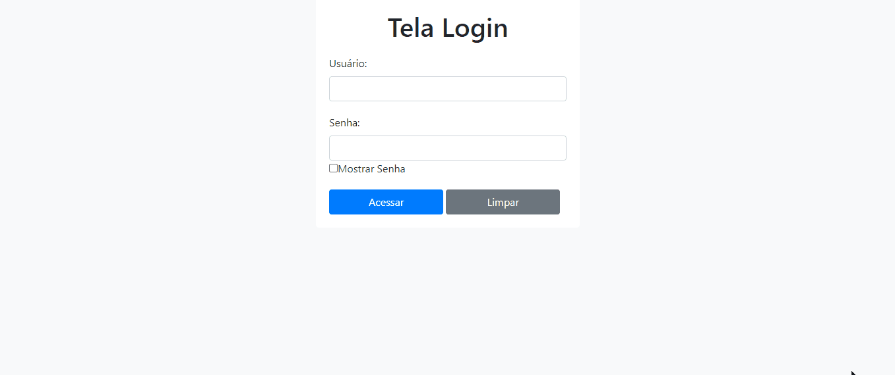
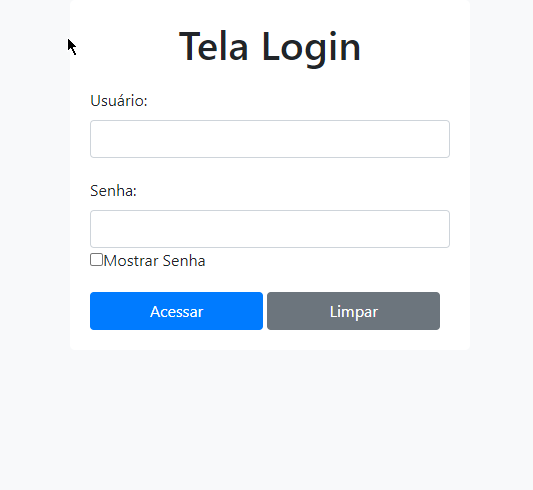
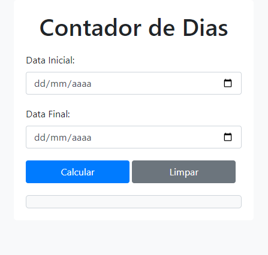
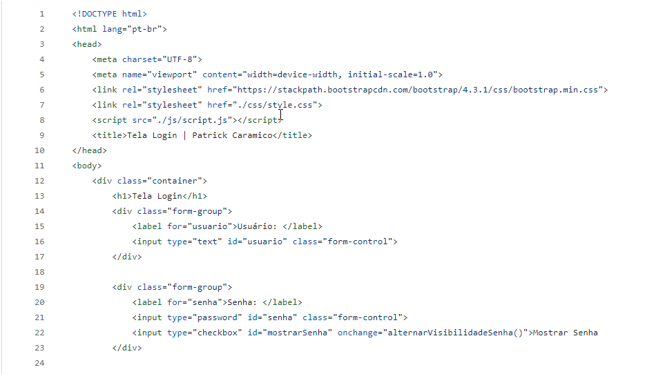
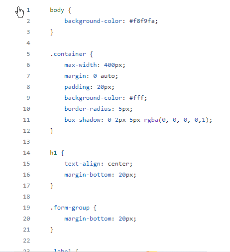
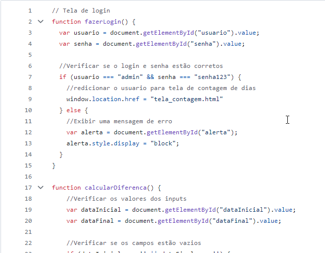

# Day_Count_Screen

Tela de login com sistema de contagem de dias.

# Readme Contents:

- [Summary](#summary)
  - [About the project](#about)
  - [preview](#preview)
  - [screenshot](#screenshot)
- [My code](#codes)
  - [HTML](#html)
  - [CSS](#css)
  - [Javascript](#js)
- [Process](#process)
  - [Designed](#designed)
- [Autor](#autor)
  - [link](#link)
 
## summary

### about

O intuito do projeto era criar um sistema de contagem de dias com tela de login, nesse sistema mostra a diferença entre dias, semanas e ano. 
O sistema de login possui uma usuario e senha cadastro, para acessar basta informar <b>usuario: admin e senha: senha123</b>.

### preview

 

### screenshot

 

## codes

### html

Code HTML

 

### css

Code CSS

 

### js

Code Js

 

## process

### designed

- Semantic HTML;
- CSS priorities;
- javascript Functions.

## autor

## link
 Clique aqui para acessar o projeto
 [Contagem Dias](https://contagemdias.netlify.app/)
